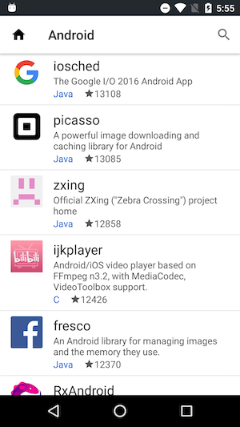

# RecyclerView with DataBinding
* Kotlin + DataBinding + RecyclerView

## Feature
* Search trending GitHub repositories.  

## Libararies
* [DataBinding](https://developer.android.com/topic/libraries/data-binding/index.html)
* [Dagger2](https://google.github.io/dagger/)
* [Picasso](http://square.github.io/picasso/)
* [Retrofit2](http://square.github.io/retrofit/)
* [RxJava2](https://github.com/ReactiveX/RxJava)
* [Moshi](https://github.com/square/moshi)

## Prerequisites
* Android SDK 25
* Android Build Tool 25.0.2
* Android Support Repository 25.2.0
* Android Plugin for Gradle 2.3.3
* Kotlin v1.1.4-3

## Getting Started
Build with Android Studio 2.x
